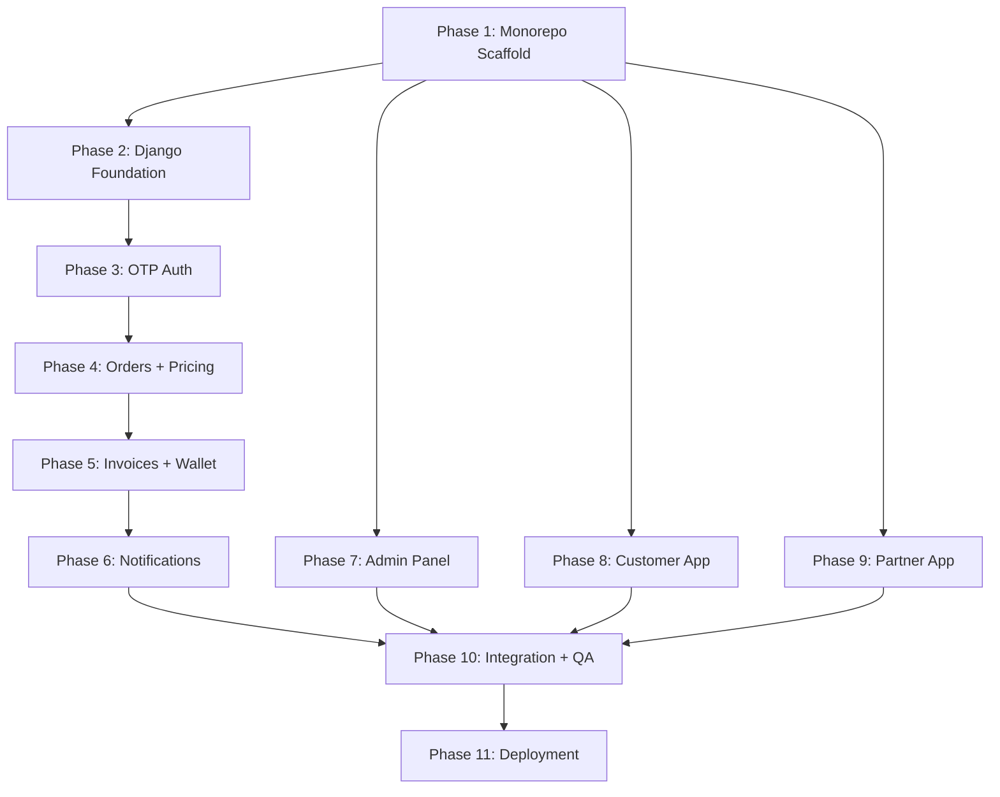

# Kabadi Man — Phased Implementation Plan

Build a three-sided hyperlocal scrap pickup marketplace: Customer App, Partner App, and Admin Panel — backed by a Django REST API with multi-city architecture.

## User Review Required

> [!IMPORTANT]
> **Fresh Build**: The monorepo directory is currently empty. This plan builds everything from scratch across 11 phases per the spec's required build order.

> [!WARNING]
> **Scope**: This is a very large project (~200+ files). Each phase will be executed sequentially. Phases 1–6 (backend) should be completed before Phases 7–9 (frontends) since the frontends depend on the APIs.

> [!CAUTION]
> **Phase 2 Lead App**: The `leads` app is scaffolded as an empty Django app per spec — no models or endpoints until Phase 2 of the product roadmap.

---

## Phase 1 — Monorepo Scaffold

**Goal**: Set up the Turborepo monorepo, all workspace packages, Docker Compose, environment files, and deployment configs.

### Root Configuration

#### [NEW] [package.json](file:///c:/Users/Lenovo/Desktop/monorepo/package.json)
- pnpm workspace root with `workspaces` field pointing to `apps/*` and `packages/*`
- Scripts: `dev`, `build`, `lint`

#### [NEW] [pnpm-workspace.yaml](file:///c:/Users/Lenovo/Desktop/monorepo/pnpm-workspace.yaml)
- Declare `apps/*` and `packages/*`

#### [NEW] [turbo.json](file:///c:/Users/Lenovo/Desktop/monorepo/turbo.json)
- Pipeline: `build`, `dev`, `lint` with proper dependency ordering

#### [NEW] [docker-compose.yml](file:///c:/Users/Lenovo/Desktop/monorepo/docker-compose.yml)
- PostgreSQL 16 (port 5432) + Redis 7-alpine (port 6379)

#### [NEW] [.env.example](file:///c:/Users/Lenovo/Desktop/monorepo/.env.example)
- All env vars from Section 11 of spec

#### [NEW] [.gitignore](file:///c:/Users/Lenovo/Desktop/monorepo/.gitignore)

---

### Django Backend Scaffold

#### [NEW] [backend/requirements/base.txt](file:///c:/Users/Lenovo/Desktop/monorepo/backend/requirements/base.txt)
- Django 5, DRF, Celery 5, psycopg2-binary, redis, simplejwt, cloudinary, drf-spectacular, django-filter, Pillow, bcrypt

#### [NEW] [backend/requirements/dev.txt](file:///c:/Users/Lenovo/Desktop/monorepo/backend/requirements/dev.txt)
- pytest-django, factory-boy, black, flake8, ipython

#### [NEW] [backend/requirements/prod.txt](file:///c:/Users/Lenovo/Desktop/monorepo/backend/requirements/prod.txt)
- gunicorn, sentry-sdk, whitenoise

#### [NEW] [backend/kabadiman/settings/base.py](file:///c:/Users/Lenovo/Desktop/monorepo/backend/kabadiman/settings/base.py)
- Common Django settings, INSTALLED_APPS (all 8 apps), DRF config, Celery config, JWT config, Cloudinary config
- All apps registered: `cities`, `accounts`, `orders`, `invoices`, `wallet`, `pricing`, `notifications`, `leads`

#### [NEW] [backend/kabadiman/settings/dev.py](file:///c:/Users/Lenovo/Desktop/monorepo/backend/kabadiman/settings/dev.py)
- DEBUG=True, local DB, console email backend

#### [NEW] [backend/kabadiman/settings/prod.py](file:///c:/Users/Lenovo/Desktop/monorepo/backend/kabadiman/settings/prod.py)
- DEBUG=False, DATABASE_URL parsing, whitenoise, Sentry

#### [NEW] [backend/kabadiman/urls.py](file:///c:/Users/Lenovo/Desktop/monorepo/backend/kabadiman/urls.py)
#### [NEW] [backend/kabadiman/wsgi.py](file:///c:/Users/Lenovo/Desktop/monorepo/backend/kabadiman/wsgi.py)
#### [NEW] [backend/kabadiman/asgi.py](file:///c:/Users/Lenovo/Desktop/monorepo/backend/kabadiman/asgi.py)
#### [NEW] [backend/kabadiman/celery.py](file:///c:/Users/Lenovo/Desktop/monorepo/backend/kabadiman/celery.py)
#### [NEW] [backend/manage.py](file:///c:/Users/Lenovo/Desktop/monorepo/backend/manage.py)
#### [NEW] [backend/render.yaml](file:///c:/Users/Lenovo/Desktop/monorepo/backend/render.yaml)
#### [NEW] [backend/Dockerfile](file:///c:/Users/Lenovo/Desktop/monorepo/backend/Dockerfile)

Scaffold all 8 Django apps as empty directories with `__init__.py`:
- `backend/apps/cities/`
- `backend/apps/accounts/`
- `backend/apps/orders/`
- `backend/apps/invoices/`
- `backend/apps/wallet/`
- `backend/apps/pricing/`
- `backend/apps/notifications/`
- `backend/apps/leads/` (Phase 2 placeholder — empty app)

---

### Shared Packages

#### [NEW] [packages/shared-types/](file:///c:/Users/Lenovo/Desktop/monorepo/packages/shared-types/)
- `package.json`, `tsconfig.json`, `src/index.ts`
- All TypeScript interfaces mirroring Django models (OrderStatus, PartnerStatus, City, CustomerProfile, PartnerProfile, Order, ScrapItem, Invoice, WalletTransaction, Notification, ScrapRate)

#### [NEW] [packages/shared-constants/](file:///c:/Users/Lenovo/Desktop/monorepo/packages/shared-constants/)
- `package.json`, `tsconfig.json`, `src/index.ts`
- ORDER_STATUS_LABELS, SCRAP_CATEGORIES, DEFAULT_TIME_SLOTS, API_BASE_URL, WALLET_LOW_BALANCE_THRESHOLD, OTP_EXPIRY_SECONDS, POLL_INTERVAL_MS

#### [NEW] [packages/shared-utils/](file:///c:/Users/Lenovo/Desktop/monorepo/packages/shared-utils/)
- `package.json`, `tsconfig.json`, `src/index.ts`
- Currency formatting (₹), date formatting, phone formatting, weight formatting helpers

---

### Frontend App Scaffolds

#### [NEW] apps/admin-panel/
- Initialize via `npx create-next-app@14` with TypeScript, Tailwind CSS, App Router, ESLint
- Install shadcn/ui, Recharts
- Create basic `app/layout.tsx`, `app/page.tsx`

#### [NEW] apps/customer-app/
- Initialize via `npx create-expo-app` with Expo SDK 51
- Configure `app.json`: package `com.kabadiman.customer`, permissions

#### [NEW] apps/partner-app/
- Initialize via `npx create-expo-app` with Expo SDK 51
- Configure `app.json`: package `com.kabadiman.partner`, permissions

---

## Phase 2 — Django Foundation

**Goal**: Build `cities` and `accounts` apps with all models, migrations, and admin registrations.

### Cities App

#### [NEW] [backend/apps/cities/models.py](file:///c:/Users/Lenovo/Desktop/monorepo/backend/apps/cities/models.py)
- `City` model: name, slug (unique), state, is_active, created_at

#### [NEW] [backend/apps/cities/admin.py](file:///c:/Users/Lenovo/Desktop/monorepo/backend/apps/cities/admin.py)
#### [NEW] [backend/apps/cities/serializers.py](file:///c:/Users/Lenovo/Desktop/monorepo/backend/apps/cities/serializers.py)
#### [NEW] [backend/apps/cities/urls.py](file:///c:/Users/Lenovo/Desktop/monorepo/backend/apps/cities/urls.py)
#### [NEW] [backend/apps/cities/views.py](file:///c:/Users/Lenovo/Desktop/monorepo/backend/apps/cities/views.py)

### Accounts App

#### [NEW] [backend/apps/accounts/models.py](file:///c:/Users/Lenovo/Desktop/monorepo/backend/apps/accounts/models.py)
- `OTPRecord`: phone_number, otp_hash (bcrypt), purpose (LOGIN/ARRIVAL_VERIFY), attempts (max 3), is_used, expires_at, created_at
- `CustomerProfile`: user (OneToOne), phone, name, address, city (FK→City), lat/lng, email, customer_type (B2C/B2B), expo_push_token, is_active
- `PartnerProfile`: user (OneToOne), phone, name, city (FK→City), 3 Cloudinary doc URLs, godown fields, approval_status (PENDING/APPROVED/REJECTED/DISABLED), rejection_reason, is_online, rating, total_ratings, expo_push_token

#### [NEW] [backend/apps/accounts/admin.py](file:///c:/Users/Lenovo/Desktop/monorepo/backend/apps/accounts/admin.py)
#### [NEW] [backend/apps/accounts/serializers.py](file:///c:/Users/Lenovo/Desktop/monorepo/backend/apps/accounts/serializers.py)
#### [NEW] [backend/apps/accounts/urls.py](file:///c:/Users/Lenovo/Desktop/monorepo/backend/apps/accounts/urls.py)

Seed data: management command to create initial cities (Mumbai, Delhi, Bangalore, etc.)

---

## Phase 3 — OTP Auth System

**Goal**: Abstract OTP provider, auth endpoints, JWT config.

#### [NEW] [backend/apps/accounts/otp_service.py](file:///c:/Users/Lenovo/Desktop/monorepo/backend/apps/accounts/otp_service.py)
- `BaseOTPService` abstract class with `send(phone, otp) → bool`
- `ConsoleOTPService` — prints to terminal
- `MSG91OTPService`, `Fast2SMSOTPService`, `TwilioOTPService` — stubs
- `get_otp_service()` factory using `settings.OTP_PROVIDER`

#### [NEW] [backend/apps/accounts/views.py](file:///c:/Users/Lenovo/Desktop/monorepo/backend/apps/accounts/views.py)
- `SendOTPView` — POST `/api/v1/auth/send-otp/` — rate limit 3/hr/phone, generates OTP, stores bcrypt hash, sends via provider
- `VerifyOTPView` — POST `/api/v1/auth/verify-otp/` — validates OTP, returns JWT tokens + `is_new_user`
- `RefreshTokenView` — POST `/api/v1/auth/refresh/`
- `RegisterCustomerView` — POST `/api/v1/auth/register/customer/`
- `RegisterPartnerView` — POST `/api/v1/auth/register/partner/`
- `UpdatePushTokenView` — PUT `/api/v1/auth/push-token/`

All endpoints return `{ success, data, error }` format.

---

## Phase 4 — Orders + Pricing

**Goal**: Full order lifecycle, pricing models, rate resolution.

### Pricing App

#### [NEW] [backend/apps/pricing/models.py](file:///c:/Users/Lenovo/Desktop/monorepo/backend/apps/pricing/models.py)
- `ScrapCategory`: name, slug, icon_url, is_active
- `CustomerRate`: category (FK), city (FK), price_per_kg — unique_together
- `PartnerDefaultRate`: category (FK), city (FK), price_per_kg — unique_together
- `PartnerCustomRate`: partner (FK), category (FK), price_per_kg — unique_together
- `PartnerRateRequest`: partner, category, requested_rate, current_rate, reason, status (PENDING/APPROVED/REJECTED), reviewed_by, review_notes

#### [NEW] [backend/apps/pricing/utils.py](file:///c:/Users/Lenovo/Desktop/monorepo/backend/apps/pricing/utils.py)
- `resolve_partner_rate(partner, category)` — PartnerCustomRate → PartnerDefaultRate fallback

#### [NEW] Pricing serializers, views, urls, admin

### Orders App

#### [NEW] [backend/apps/orders/models.py](file:///c:/Users/Lenovo/Desktop/monorepo/backend/apps/orders/models.py)
- `Order`: all fields from spec, `transition_to(new_status)` method with state machine validation, auto-sets timestamp fields
- `ScrapItem`: order FK, category FK, weight_kg, customer_rate/amount, partner_rate/amount (snapshots)
- `OrderRating`: order (OneToOne), customer FK, rating 1-5, feedback
- `InvalidTransitionError` custom exception
- City-prefixed order_id generator: `KM-{city_slug.upper()[:3]}-{year}-{sequence}`

#### [NEW] Order serializers, views, urls, admin
- Customer endpoints: create order, current order, history, detail, cancel, rating
- Partner endpoints: assigned/upcoming/history, accept/reject, on-the-way/arrived/verify-otp/submit-scrap/confirm-payment
- Admin endpoints: new/scheduled/ongoing/completed/cancelled/all, manual create, assign/reassign/cancel/complete

---

## Phase 5 — Invoices + Wallet

**Goal**: Dual invoice system, atomic wallet deductions.

### Invoices App

#### [NEW] [backend/apps/invoices/models.py](file:///c:/Users/Lenovo/Desktop/monorepo/backend/apps/invoices/models.py)
- `Invoice`: order (OneToOne), customer_total, partner_total, commission (auto-calc), status (PENDING_APPROVAL/APPROVED), admin_notes, approved_by, timestamps

#### [NEW] Invoice serializers, views, urls, admin

### Wallet App

#### [NEW] [backend/apps/wallet/models.py](file:///c:/Users/Lenovo/Desktop/monorepo/backend/apps/wallet/models.py)
- `PartnerWallet`: partner (OneToOne), balance, updated_at
  - `deduct(amount, order, notes)` — MUST use `@transaction.atomic` + `select_for_update()`
  - `credit(amount, notes)` — same pattern
- `WalletTransaction`: wallet FK, type (COMMISSION_DEDUCTION/TOP_UP/ADMIN_ADJUSTMENT), amount, balance_before, balance_after, reference_order, notes

#### [NEW] Wallet serializers, views, urls, admin

### Invoice Approval Flow (in invoices views)
- On `POST /admin/invoices/{id}/approve/`:
  1. `@transaction.atomic`
  2. `select_for_update()` on PartnerWallet
  3. Check sufficient balance
  4. Deduct commission from wallet
  5. Create WalletTransaction record
  6. Set invoice status = APPROVED
  7. Transition order to COMPLETED, set `completed_at`

---

## Phase 6 — Notifications

**Goal**: Push notification system, all 11 event triggers.

#### [NEW] [backend/apps/notifications/models.py](file:///c:/Users/Lenovo/Desktop/monorepo/backend/apps/notifications/models.py)
- `NotificationTemplate`: name (unique), title_template, body_template, is_active
- `Notification`: recipient_type, recipient_id, title, body, type, reference_id, is_read, city FK

#### [NEW] [backend/apps/notifications/push_service.py](file:///c:/Users/Lenovo/Desktop/monorepo/backend/apps/notifications/push_service.py)
- `send_expo_push(expo_token, title, body, data)`
- `@shared_task send_push_notification_task` (Celery, max_retries=3)

#### [NEW] [backend/apps/notifications/triggers.py](file:///c:/Users/Lenovo/Desktop/monorepo/backend/apps/notifications/triggers.py)
- Functions for all 11 notification events called from order/invoice lifecycle

#### [NEW] Notification serializers, views, urls, admin

### Leads App (Phase 2 Scaffold)

#### [NEW] [backend/apps/leads/](file:///c:/Users/Lenovo/Desktop/monorepo/backend/apps/leads/)
- Empty app: `__init__.py`, `apps.py`, `models.py` (empty), `admin.py`, `views.py`

---

## Phase 7 — Admin Panel (Next.js 14)

**Goal**: Full admin web panel with all 12 pages per spec.

### Core Architecture

#### [NEW] app/(auth)/login/page.tsx
- Admin JWT login

#### [NEW] app/(dashboard)/layout.tsx
- Sidebar navigation + top navbar with **global city filter dropdown** (React Context + localStorage)

#### [NEW] lib/api.ts
- Axios instance with interceptors, auth header injection, city_id param injection

#### [NEW] lib/city-context.tsx
- CityProvider context: selected city, cities list, auto-refetch on change

### Pages (12 total)

| Page | Route | Key Features |
|------|-------|-------------|
| Dashboard | `/` | 8 KPI cards, auto-refresh 30s, trend arrows |
| New Orders | `/orders/new` | Cards with assign partner modal, cancel dialog |
| Scheduled | `/orders/scheduled` | Today's assigned orders table |
| Ongoing | `/orders/ongoing` | Live ON_THE_WAY + ARRIVED |
| Completed | `/orders/completed` | Today's completed |
| Cancelled | `/orders/cancelled` | Today's cancelled |
| All Orders | `/orders/all` | Historical paginated with filters |
| Order Detail | `/orders/[id]` | Timeline + scrap items + invoice |
| Invoices | `/invoices` | Split-panel: customer vs partner, inline edit, approve |
| Partners | `/partners` | Card grid + detail page (7 sections) |
| Customers | `/customers` | Table + detail page, add/edit/deactivate |
| Pricing | `/pricing` | 3 tabs: customer rates, partner default/custom, rate requests |
| KPI | `/kpi` | 10 metrics, 4 Recharts, 7 TATs, CSV export |
| Notifications | `/notifications` | 3 tabs: received, sent, broadcast compose |
| Settings | `/settings` | Cities, categories, slots, config, export, security |
| Info | `/info` | Static docs |

### UI Components (shadcn/ui based)
- DataTable, KPICard, OrderCard, StatusBadge, TimelineStepper, InvoicePanel, CityFilterDropdown, PartnerAssignModal, BroadcastComposer

### Charts (Recharts)
- Orders Over Time (line), Revenue Over Time (bar), Scrap by Category (pie), Customer Type Split (donut)

---

## Phase 8 — Customer App (Expo)

**Goal**: Full customer mobile app with 12 screens.

### Screens

| Screen | Key Implementation |
|--------|-------------------|
| Splash | AsyncStorage token check → route |
| PhoneEntry | Phone input + Send OTP |
| OTPVerify | 6-digit input, 5-min timer, resend |
| ProfileSetup | Name, address, city, GPS |
| Home | City display, Create Pickup CTA, active order card |
| CreatePickup (3 steps) | Date/slot → Photo upload → Description + confirm |
| CurrentOrder | **Critical**: 30s polling, arrival OTP display, status timeline, partner card, cancel/rate buttons |
| OrderHistory | Tabs: Completed / Cancelled |
| OrderDetail | Timeline + scrap items + invoice |
| Pricing | City-scoped customer rates |
| RatingScreen | 1-5 stars + feedback |
| Profile | View/edit profile |
| Notifications | In-app list with unread badge |
| RecyclingInfo | Static educational content |

### Key Integrations
- `expo-notifications` for push token registration
- `expo-image-picker` for scrap photos
- `expo-location` for GPS coordinates

---

## Phase 9 — Partner App (Expo)

**Goal**: Full partner mobile app with 16 screens.

### Screens

| Screen | Key Implementation |
|--------|-------------------|
| Splash | Token check → route based on approval_status |
| PhoneEntry + OTPVerify | Same as customer |
| Registration (6 steps) | Name → Aadhaar upload → Vehicle doc → License → Godown → Review + submit |
| PendingApproval | Waiting screen |
| RejectedScreen | Shows reason, re-submit option |
| Dashboard | Online/offline toggle + assigned orders list |
| ActiveOrder (10 steps) | **Critical**: View → Accept/Reject → On The Way → Arrived → OTP Entry → Scrap Entry → Review → Submit → Awaiting Approval → Confirm Payment → Completed |
| OrderHistory | Completed + cancelled tabs |
| Wallet | Balance card (red warning <₹200) + transaction list |
| Pricing | Partner's effective rates |
| RateRequest | Request rate change form + history |
| Notifications | In-app list |
| Profile | Partner info + document status |

### Key Integrations
- `expo-document-picker` for Aadhaar/license uploads
- `expo-image-picker` for scrap photos
- `expo-location` for GPS
- `expo-notifications` for push

---

## Phase 10 — Integration + QA

**Goal**: Wire everything together, test end-to-end flows.

### Automated Tests

Run from `backend/` directory:

```bash
# Create virtualenv and install
python -m venv venv
venv\Scripts\activate
pip install -r requirements/dev.txt

# Run all tests
python manage.py test --settings=kabadiman.settings.dev
```

**Minimum required tests:**

| Test | File | What It Covers |
|------|------|---------------|
| OTP Flow | `backend/apps/accounts/tests/test_otp.py` | Send OTP, verify, rate limiting, expiry |
| Order State Machine | `backend/apps/orders/tests/test_state_machine.py` | All valid transitions, invalid transition raises error |
| Wallet Atomicity | `backend/apps/wallet/tests/test_wallet.py` | Deduct, insufficient balance, transaction log |
| City Filter | `backend/apps/orders/tests/test_city_filter.py` | Admin endpoints filter by city_id |

### Manual Verification

1. **Full Order Lifecycle**: Create order as customer → admin assigns partner → partner executes all 10 steps → admin approves invoice → wallet deducted → order completed
2. **Multi-City Isolation**: Create orders in two cities, verify admin city filter correctly isolates data
3. **Partner Rejection Flow**: Partner rejects order → order returns to NEW → admin reassigns
4. **Wallet Low Balance**: Drain wallet below ₹200 → verify low balance notification triggers
5. **Rate Change Request**: Partner requests rate change → admin approves → verify PartnerCustomRate created

### Browser Testing (Admin Panel)
- Navigate to each of the 12 admin pages
- Verify city filter dropdown changes data
- Test invoice approval split-panel UI
- Test KPI charts render with data

---

## Phase 11 — Render Deployment

**Goal**: Production deployment.

### Steps
1. Push code to GitHub
2. Create Render Web Service for Django API
3. Create Render Worker for Celery
4. Create Render PostgreSQL + Redis instances
5. Set all env vars from `.env.example` in Render dashboard
6. Run migrations on Render
7. Deploy admin panel to Vercel (connect GitHub repo, set `NEXT_PUBLIC_API_URL`)
8. Configure Cloudflare DNS + SSL
9. Verify all production endpoints respond correctly

### Verification
```bash
# Test production API
curl https://your-app.onrender.com/api/v1/admin/cities/

# Test admin panel
# Navigate to Vercel URL in browser
```

---

## Dependency Graph



> [!NOTE]
> Phases 7, 8, 9 (frontends) can begin their scaffolding in Phase 1 but full page implementation requires the APIs from Phases 2–6 to be complete.
